# Persistence Layer Design

## 1. Overview

The persistence layer provides a generic, type-safe data access abstraction for the Update Service, enabling consistent storage and retrieval of domain entities with built-in versioning, concurrency control, and audit capabilities. The layer is designed to operate in a Windows Server Failover Cluster environment with storage placed in Cluster Shared Volumes (CSV).

### Key Design Feature: Attribute-Driven Architecture

The persistence layer uses an **attribute-driven approach** where:
- Entity classes that implement `IEntity<TKey>` and have a `[Table]` attribute automatically get:
  - Database schema generation (CREATE TABLE, indexes, constraints)
  - Full CRUD operations without manual SQL
  - Configurable soft-delete behavior via `SoftDeleteEnabled` property
  - Automatic version management and concurrency control
- No boilerplate code required - just define your entity with attributes
- Type-safe, compile-time validated, and IntelliSense supported

### 1.1 Update Lifecycle Flow

The following diagram illustrates how updates are discovered, stored, and applied through the system:

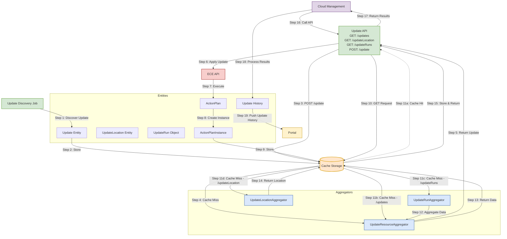

**Key Components:**
- **Update Discovery Job**: Scheduled job that discovers available updates from various sources
- **ECE API**: Enterprise Cloud Engine API that executes ActionPlans for updates
- **Update API**: RESTful API with endpoints:
  - `GET /updates`: Retrieve available updates (cache-first, fallback to UpdateResourceAggregator)
  - `GET /updateLocation`: Get update location information (cache-first, fallback to UpdateLocationAggregator)
  - `GET /updateRuns`: Get update run history (cache-first, fallback to UpdateRunAggregator)
  - `POST /update`: Apply an update (triggers ECE execution)
- **Aggregators** (grouped components under `..\src\UpdateResourceProvider\UpdateService\Core\Source`):
  - **UpdateRunAggregator**: Aggregates update run information from multiple sources
  - **UpdateResourceAggregator**: Manages update resource data and relationships
  - **UpdateLocationAggregator**: Manages update location data and status
- **Entities** (model objects under `..\src\UpdateResourceProvider\UpdateService\Models\Core\`):
  - **Update**: Represents an available update package
  - **UpdateLocation**: Represents update status at a specific location
  - **UpdateRun**: Represents an update execution instance
  - **ActionPlan/ActionPlanInstance**: ECE execution [plans](..\src\EceClient\Models\ActionPlanInstanceDescription.cs) and their [instances](..\src\EceClient\Models\ActionPlanInstance.cs)
  - **UpdateHistory**: Historical update data for portal display
- **Cache Storage**: Persistent storage layer with cache-first access pattern for all entities
- **Cloud Management**: External service that polls Update API for update runs and processes results
- **Portal**: Azure portal that displays update history and status to end users

### 1.2 Update History Flow

The following sequence diagram illustrates how Cloud Management retrieves update history and location information:

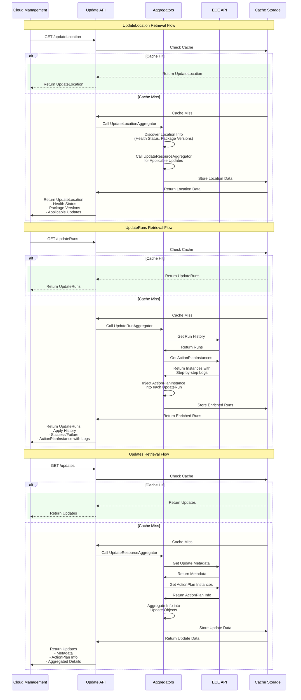

**Key Flow Details:**

1. **UpdateLocation Retrieval**:
   - Cloud Management requests location information via `GET /updateLocation`
   - Update API checks cache first (cache-first pattern)
   - On cache miss, UpdateLocationAggregator discovers:
     - Current health check status
     - Installed package versions
     - Applicable updates (via UpdateResourceAggregator)
   - Results are cached before returning to Cloud Management

2. **UpdateRuns Retrieval**:
   - Cloud Management requests run history via `GET /updateRuns`
   - Update API checks cache first
   - On cache miss, UpdateRunAggregator:
     - Fetches run history from ECE API
     - Retrieves ActionPlanInstances with detailed step-by-step logs
     - Injects ActionPlanInstance into each UpdateRun
   - Enriched results are cached before returning

3. **Updates Retrieval**:
   - Cloud Management requests available updates via `GET /updates`
   - Update API checks cache first (cache-first pattern)
   - On cache miss, UpdateResourceAggregator:
     - Fetches update metadata from ECE API
     - Retrieves ActionPlan instances for updates
     - Aggregates information into Update objects
   - Aggregated results are cached before returning

4. **Data Enrichment**:
   - UpdateRuns are enriched with ActionPlanInstances containing:
     - Detailed execution logs for each step
     - Success/failure status
     - Timing information
     - Error details (if any)
   - Updates are enriched with:
     - Metadata from ECE
     - ActionPlan information
     - Aggregated details for display

### 1.3 New Update History Flow (Future Implementation)

The following sequence diagram illustrates the enhanced update history flow with long-term retention:

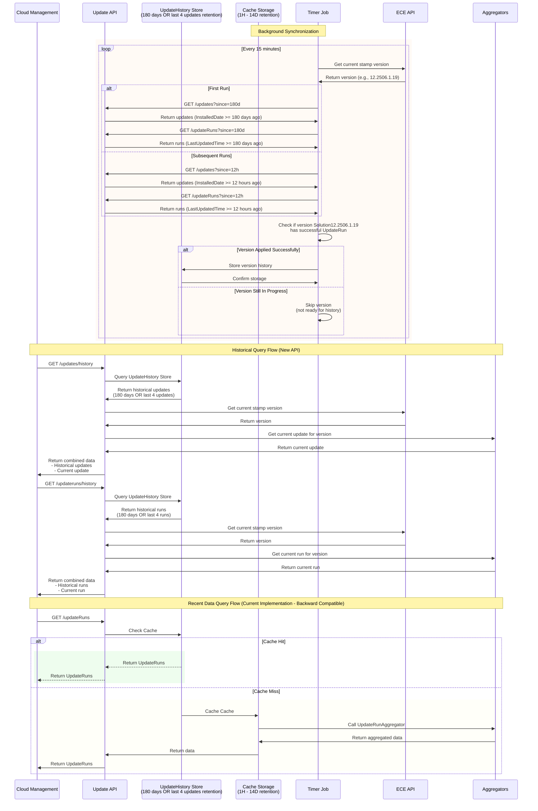

**Key Design Changes:**

1. **Dual Storage Architecture** since they serve different purposes:
   - **Cache Storage**: transaction data store
     - Key-Value Store (KVS) with JSON serialization
     - 1h-14d expiration policy
     - Fast retrieval by key
     - Lited query capabilities
   - **UpdateHistory Store**: report data store
     - Fully relational database with normalized schema
     - 180-day retention period (OR last 4 updates if older)
     - Expanded entity fields with proper columns
     - Rich query support with joins and indexes
     - Optimized for complex analytical queries

2. **Timer Job Synchronization**:
   - Calls update API via UpdateServiceClient, which is created by failover service resolver
   - Runs every 15 minutes (configurable)
   - First checks current stamp version from ECE (e.g., 12.2506.1.19)
   - Queries Update API with time-based filtering:
     - First run: `since=180d` to fetch 180 days of history
     - Subsequent runs: `since=12h` to fetch updates from last 12 hours
   - Filters based on:
     - `InstalledDate` field for Update entities
     - `LastUpdatedTime` field for UpdateRun entities
   - Only stores versions that have been applied successfully
   - Skips versions still in progress
   - Transforms JSON data to relational format for UpdateHistory Store
   - Maintains referential integrity and indexes

3. **API Endpoints and Routing**:
   - **GET /updateRuns** (Current Implementation - Backward Compatible):
     - Returns recent update runs (≤1h-14d)
     - Uses Cache Storage for fast retrieval
     - Simple key-based lookups
     - Maintains exact same behavior as current implementation
     - Enables safe rollout/rollback by just changing API request paths
   - **GET /updates/history**:
     - New endpoint on Updates controller
     - Returns historical updates (180 days OR last 4 updates)
     - Queries UpdateHistory Store for historical data
     - Checks current stamp version from ECE
     - Calls aggregator to get current update
     - Returns combined historical + current data
   - **GET /updateruns/history**:
     - New endpoint on UpdateRuns controller
     - Returns historical runs (180 days OR last 4 runs)
     - Queries UpdateHistory Store for historical data
     - Checks current stamp version from ECE
     - Calls aggregator to get current run
     - Returns combined historical + current data

4. **Storage Comparison**:
   | Aspect | Cache Storage | UpdateHistory Store |
   |--------|--------------|-------------------|
   | Type | Key-Value Store | Relational Database |
   | Format | JSON blobs | Normalized tables |
   | Query | By key only | SQL with joins |
   | Indexes | Primary key | Multiple indexes |
   | Retention | 1H - 14D | 180 days (or last 4 updates) |
   | Use Case | Fast retrieval | Analytics & reporting |

5. **Benefits**:
   - Optimized storage for different access patterns
   - Rich query capabilities for historical analysis
   - Efficient resource utilization
   - Support for complex reporting requirements
   - **Safe Rollout Strategy**:
     - Existing `/updateRuns` endpoint remains unchanged
     - New `/updates/history` and `/updateruns/history` endpoints are additive
     - Can switch between old and new behavior by changing request paths
     - Zero-downtime rollback capability if issues arise

### 1.4 Goals

- Provide a simple, generic and type-safe persistence layer for the Update Service
- Build L2 cache on top of persistence layer

### 1.5 Non-Goals

- not cross-platform, service targeting net472 on windows
- no distributed transaction coordinator, backend storage is locked by single process
- archive/backup feature is out-of-scope
- no encryption

## 2. Functional Requirements

### 2.1 Core Capabilities
- **Generic Entity Storage**: Support for any entity type with configurable keys and indexes
  - for DB backend:
    - Table schema generation based on property attributes
    - Supports single and composite primary keys
    - Supports unique constraints and non-clustered indexes
    - Supports foreign key relationships between entities
  - for File backend:
    - key-value storage with JSON serialization, any entities without default constructor, use custom `JsonConverter`
    - Key is arranged as two parts: `EntityTypeName/EntityId`, entity id is either a field or queryHash.
    - Value is serialized JSON representation of the entity, plus additional metadata: CreationTime, LastWriteTime, Version, and ExpirationTime (if applicable)
    - metadata is stored in memory for fast access, as well as stored per entity type in a separate file. Metadata is persisted to disk both by interval (asynchronously) and on shutdown (synchronously). It contains:
      - EntityTypeName
      - PrimaryKeyFieldName
      - Size
      - Tags (for query purpose)
      - AdditionalParameters (KVPs used to get entity id/queryHash)
      - TrackingFields (CreateTime, LastWriteTime, Version)
- **CRUD Operations**: Create, Read, Update, Delete operations for each entity type
  - supports both single entity operations and list operations
  - supports optimistic concurrency control using versioning
  - supports soft delete (marking entities as deleted without physical removal)
  - supports bulk operations with configurable batch sizes (for speed, there is no locking/transaction)
  - all methods are asynchronous, wraps sync methods if async is not available in the underlying storage (such as SQLite transaction operations)
  - supports both commit and rollback, that takes list of Action<T> as argument.
- **Query Support**: Expression-based queries that can be translated to underlying storage queries
- **Versioning**: Automatic version tracking for optimistic concurrency control
- **Audit Trail**: Built-in creation and modification timestamps for all entities
- **Index Management**: Declarative index configuration per entity type
- **Transaction Support**: Ordered list of operations that can be committed or rolled back
- **Retention Policies**: Configurable entity expiration and cleanup/archive operations
- **Update History Management**: Long-term storage and retrieval of update run history
  - Separate relational database for minimum of 6-month retention
  - Normalized schema based on UpdateRunClient entity
  - Rich query capabilities with filters, joins, and aggregations
  - Background synchronization from cache to history store
  - Dedicated API endpoint (/updateHistory) for historical queries

### 2.2 Query Features
- Predicate-based filtering using LINQ expressions
- Pagination support with configurable page sizes
- Sorting by any entity field
- Projection support for selecting specific fields
- Aggregation capabilities (count, sum, average)

## 3. Non-Functional Requirements

### 3.1 Performance
- Based on benchmark analysis, we should be able to achieve: single entity CRUD operations: < 20ms for small payload (<1KB), 100ms for medium payload (1KB-100KB), and 2s for large payload (1-20MB)
- Batch operations: ~100 operations per second
- Query response time < 500ms for result sets up to 1000 records
- CSV access optimization for cluster shared storage

### 3.2 Scalability
- Efficient handling of large entity payloads (1-20MB per entity)
- Multi-node concurrent access to CSV storage is NOT supported.
- Configurable caching layer for frequently accessed data
- Asynchronous operation support throughout

### 3.3 Reliability
- Failover cluster aware with automatic node failover support
- Data integrity validation at persistence boundaries

### 3.4 Security
- Parameter sanitization to prevent injection attacks
- Field-level encryption support for sensitive data
- Audit logging of all data modifications
- Windows integrated authentication and ACL support

## 4. Conceptual Design

### 4.1 Entity Model

Every persistable entity must:
1. **Have a `[Table]` attribute** - Defines table name and behavior configuration
2. **Implement `IEntity<TKey>` interface** OR **inherit from `BaseEntity<TKey>`** - Provides required entity contract
3. **Define a primary key** - Single key (Id) or composite key (Id + Version) based on configuration

The `[Table]` attribute is the central configuration point that controls:
- **Soft Delete Behavior** (`SoftDeleteEnabled`): Determines if entity uses versioning and soft deletes
- **List Mapping** (`ListCachingEnabled`): Enables caching of entity lists and query results
- **Expiration** (`ExpirySpan`): Sets automatic expiration time for cached entities
- **Archival** (`EnableArchive`): Enables archiving of expired entities instead of deletion

#### Entity Requirements by Table Configuration

**Basic Entity (Minimal Requirements):**
```csharp
[Table("Settings")]
public class SettingEntity : BaseEntity<string>
{
    public string Value { get; set; }
}
```

**Versioned Entity (Soft Delete Enabled):**
```csharp
[Table("Orders", SoftDeleteEnabled = true)]
public class OrderEntity : BaseEntity<string>, IVersionedEntity<string>
{
    public long Version { get; set; }
    public bool IsDeleted { get; set; }
    // Additional properties...
}
```

**Expirable Entity (With Expiration):**
```csharp
[Table("CacheEntry", ExpirySpan = "1.00:00:00")]
public class CacheEntry : BaseEntity<string>, IExpirableEntity<string>
{
    public DateTimeOffset CreationTime { get; set; }
    public DateTimeOffset AbsoluteExpiration { get; set; }
    // Additional properties...
}
```

**Fully Configured Entity:**
```csharp
[Table("AuditLog",
    SoftDeleteEnabled = true,
    ListCachingEnabled = true,
    ExpirySpan = "30.00:00:00",
    EnableArchive = true)]
public class AuditLogEntity : BaseEntity<string>, IVersionedEntity<string>, IExpirableEntity<string>
{
    // Required by IVersionedEntity
    public long Version { get; set; }
    public bool IsDeleted { get; set; }

    // Required by IExpirableEntity
    public DateTimeOffset CreationTime { get; set; }
    public DateTimeOffset AbsoluteExpiration { get; set; }

    // Required by EnableArchive
    public bool IsArchived { get; set; }

    // Entity-specific properties
    public string Action { get; set; }
    public string UserId { get; set; }
}
```

#### Additional Entity Configuration

Entities also support field-level configuration through attributes:
- **`[Column]`**: Maps properties to database columns with SQL type
- **`[Index]`**: Creates database indexes for query optimization
- **`[ForeignKey]`**: Defines relationships between entities
- **`[NotMapped]`**: Excludes properties from persistence

### 4.2 Repository Pattern
Generic repository interface `IRepository<T>` providing:
- Type-safe CRUD operations on single entity or list of entities
- Expression-based query capabilities for queries
- Automatic tracking field management
- Concurrency conflict detection

### 4.3 Storage Architecture
- **Primary Storage**: File storage on Cluster Shared Volumes
- **Failover Support**: Automatic reconnection on node failover is managed by service.
- **Regular Backups**: Scheduled backups of CSV storage to recover from data loss (out-of-scope but planned)
- **Data Integrity**: Validation using checksums or hashes for large payloads (out-of-scope but planned)

## 5. Architecture

### 5.1 Layered Architecture

The persistence layer follows a clean architecture pattern with clear separation of concerns:

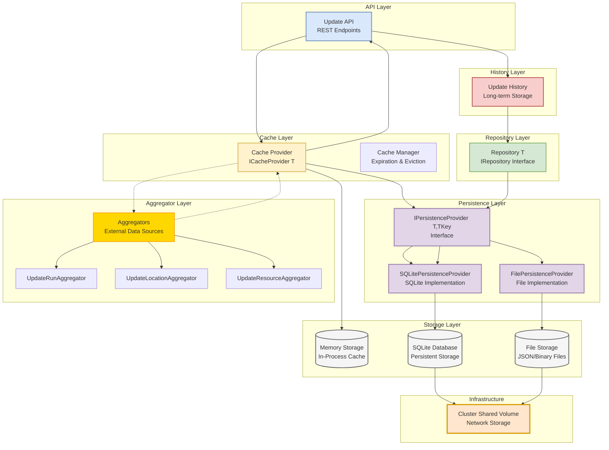

**Layer Responsibilities:**

1. **API Layer**:
   - Exposes REST endpoints for update operations
   - Routes requests to appropriate layers (Cache for current data, History for historical data)

2. **Cache Layer**:
   - Provides fast data access through `ICacheProvider<T>` interface
   - Manages cache expiration and eviction policies
   - Checks multiple storage backends in order: Memory → SQLite/File
   - Triggers aggregator refresh on cache miss

3. **History Layer**:
   - Handles long-term data retention (180 days or last 4 updates)
   - Provides historical query capabilities
   - Uses Repository pattern for data access

4. **Repository Layer**:
   - Implements `IRepository<T>` for type-safe data operations
   - Provides CRUD operations through `IPersistenceProvider<T,TKey>`
   - Handles entity mapping and SQL generation

5. **Aggregator Layer**:
   - Fetches data from external sources (ECE, Discovery Service)
   - Contains specialized aggregators for different data types
   - Called only on cache misses to refresh data

6. **Storage Layer**:
   - **Memory Storage**: In-process cache for ultra-fast access
   - **SQLite Database**: Persistent storage with ACID guarantees
   - **File Storage**: JSON/Binary file storage for large objects
   - All storage types reside on Cluster Shared Volume (CSV)

**Data Flow Patterns:**

1. **Cache-First Pattern** (Steps 1-5):
   - API requests data from Cache Layer
   - Cache checks Memory first, falls back to SQLite/File if needed
   - On cache miss, Cache calls Aggregators to fetch fresh data
   - Aggregators return data to Cache, which stores it
   - Cache returns the requested entity to API

2. **Historical Data Pattern** (Steps 6-9):
   - API requests historical data from History Layer
   - History uses Repository to query persistent storage
   - Repository executes queries against SQLite database
   - Results flow back through the layers to API

**Key Design Principles:**
- Clear separation of concerns between layers
- Cache layer abstracts storage complexity from API
- Repository pattern provides consistent data access
- All persistent storage (SQLite and Files) resides on CSV for high availability
- Aggregators are called only when needed (cache miss)

### 5.2 Attribute-Driven Design

The persistence layer uses an **attribute-driven architecture** that automatically generates database schemas and CRUD behaviors based on entity class definitions:

#### 5.2.1 Automatic Schema Generation
When an entity class:
1. Implements `IEntity<TKey>` interface
2. Has a `[Table]` attribute
3. Uses mapping attributes (`[Column]`, `[Index]`, `[PrimaryKey]`, etc.)

The system automatically:
- Generates CREATE TABLE statements
- Creates appropriate indexes
- Sets up foreign key relationships
- Configures primary key strategy based on `SoftDeleteEnabled`
- Handles SQL type mappings

#### 5.2.2 Automatic CRUD Behavior
The attribute configuration determines:
- **Create**: INSERT with auto-generated version
- **Read**: SELECT with version ordering (if soft-delete enabled)
- **Update**: INSERT new version (soft-delete) or UPDATE in-place
- **Delete**: Soft delete flag or hard DELETE based on configuration

Example:
```csharp
[Table("UpdateHistory", SoftDeleteEnabled = false)]
public class UpdateHistoryEntity : BaseEntity<string>
{
    [Column("DisplayName", SqlDbType.Text)]
    public string DisplayName { get; set; }

    [Index("IX_UpdateHistory_State")]
    [Column("State", SqlDbType.Text)]
    public string State { get; set; }
}
// This automatically generates schema and CRUD operations
```

#### 5.2.3 Soft Delete Behavior

The `SoftDeleteEnabled` attribute fundamentally changes the entity's database schema and behavior:

**When SoftDeleteEnabled = false (Single Key Mode):**
- **Primary Key**: `Id` only
- **Entity Class**: Inherits only from `BaseEntity<TKey>`
- **Version**: Single version per entity, version field used for optimistic concurrency, and changed within the scope of entity (no FK to Version table)
- **Create**: Can proceed when Key does not exist (new row is inserted), and set `Version = 1`
- **Updates**: In-place updates when version matches (existing row is not modified by other threads)
- **Deletes**: Hard delete (row is permanently removed from table) without version check.
- **Schema**: Simple table with single primary key

**When SoftDeleteEnabled = true (Composite Key Mode):**
- **Primary Key**: `Id + Version` (composite key)
- **Entity Class**: Inherits from `BaseEntity<TKey>` and implements `IVersionedEntity<TKey>`
- **Required Properties**:
  - `long Version { get; set; }` - References the global Version table
  - `bool IsDeleted { get; set; }` - Soft delete flag
- **Version**: Multiple versions per entity (new version for each update)
- **Create**: Can proceed when Key does not exist, or exist but latest version is soft-deleted
- **Updates**: Current version value should matches entity's latest version, get next version value and insert with new version (existing rows are never modified)
- **Deletes**: Soft delete (new version inserted with IsDeleted = true)
- **Schema**: Table with composite primary key and foreign key to Version table

##### 5.2.3.1 Create Operation

The Create operation has distinct behavior based on the `SoftDeleteEnabled` and `EnableExpiry` settings:

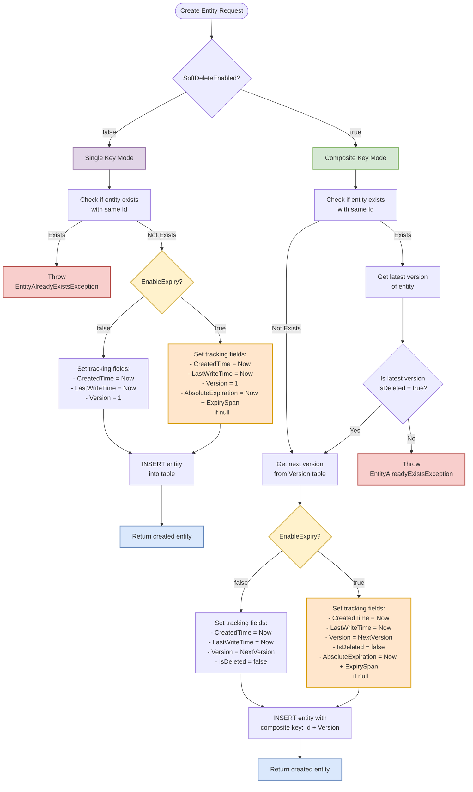


##### 5.2.3.2 Read Operation

The Read operation (GetAsync) has different behavior based on the `SoftDeleteEnabled` and `EnableExpiry` settings:

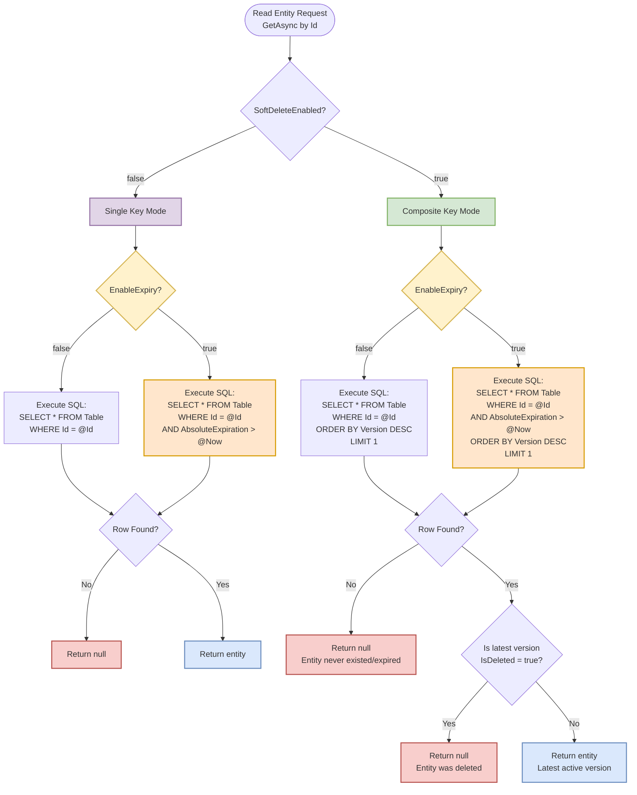


##### 5.2.3.3 Update Operation

The Update operation has different behavior based on the `SoftDeleteEnabled` setting:

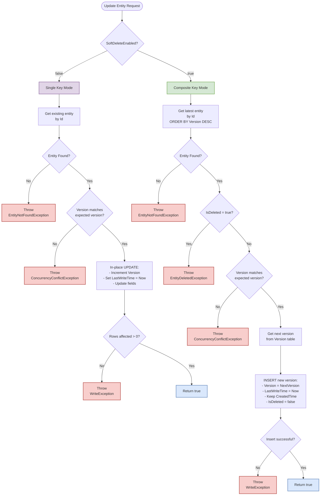

##### 5.2.3.4 Delete Operation

The Delete operation has different behavior based on the `SoftDeleteEnabled` setting:

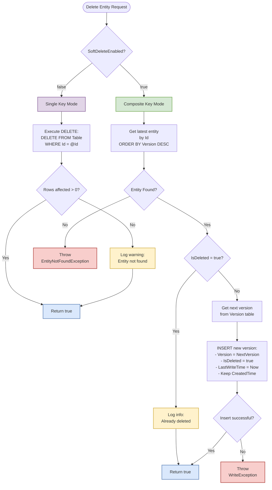

##### 5.2.3.5 Choosing Between Soft Delete Modes

Use this decision matrix to choose the appropriate `SoftDeleteEnabled` setting:

| Scenario | SoftDeleteEnabled | Rationale |
|----------|-------------------|-----------|
| **Configuration/Settings** | `false` | - Only current value matters<br>- No audit requirements<br>- Minimize storage |
| **Reference Data** | `false` | - Rarely changes<br>- No history needed<br>- Performance critical |
| **Transactional Data** | `true` | - Audit trail required<br>- Compliance needs<br>- History valuable |
| **Financial Records** | `true` | - Legal requirements<br>- Immutable audit trail<br>- Regulatory compliance |
| **User Activity** | `true` | - Behavior analysis<br>- Security auditing<br>- Trend tracking |
| **Temporary/Cache** | `false` | - Short-lived data<br>- High churn rate<br>- Storage efficiency |
| **Legal Documents** | `true` | - Immutability required<br>- Version tracking<br>- Compliance critical |

###### Quick Decision Guide:
1. **Need audit trail?** → Use `SoftDeleteEnabled = true`
2. **Need to track changes over time?** → Use `SoftDeleteEnabled = true`
3. **Only care about current state?** → Use `SoftDeleteEnabled = false`
4. **High volume, short-lived data?** → Use `SoftDeleteEnabled = false`
5. **Compliance/regulatory requirements?** → Use `SoftDeleteEnabled = true`

#### 5.2.4 List Sync Behavior

The persistence layer supports list synchronization for entities with the `[Table]` attribute configured with `SyncWithList = true`. This enables automatic caching of entity lists and query results.

##### 5.2.4.1 Create Operation

The `CreateBatchAsync` operation with list synchronization ensures that entities are properly tracked in the `EntryListMapping` table while maintaining consistency with soft-delete semantics.

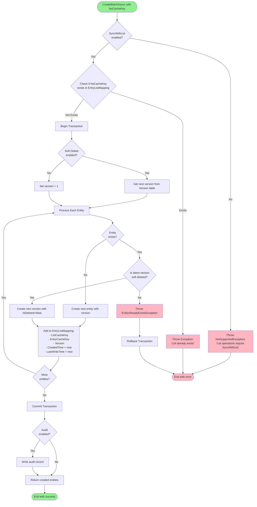

##### 5.2.4.2 Get Operation

The `GetListAsync` operation retrieves entities associated with a list while ensuring version consistency between the EntryListMapping table and the entity table.

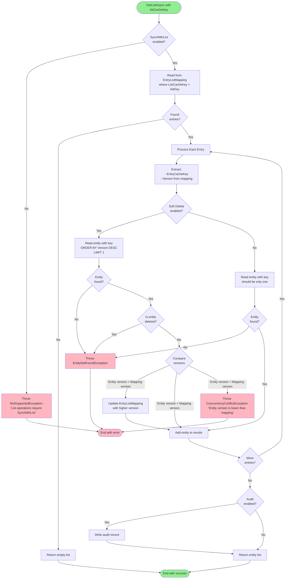

**Key Implementation Details:**

1. **SyncWithList Validation**: Ensures the entity type has SyncWithList enabled before proceeding.

2. **List Mapping Retrieval**: Queries EntryListMapping table for all entries with the specified listCacheKey, retrieving:
   - EntryCacheKey (serialized entity key)
   - Version (the version when entity was added to list)

3. **Entity Retrieval**: For each mapping entry:
   - **Soft Delete Enabled**: Fetches the latest version and verifies it's not deleted
   - **Soft Delete Disabled**: Fetches the single entity record

4. **Version Consistency Check**:
   - **Entity version > Mapping version**: Updates EntryListMapping with the newer version
   - **Entity version = Mapping version**: Proceeds normally
   - **Entity version < Mapping version**: Throws ConcurrencyConflictException (data inconsistency)

5. **Error Handling**:
   - Throws EntityNotFoundException if entity is missing or soft-deleted
   - Throws ConcurrencyConflictException if version inconsistency is detected

6. **Result Set**: Returns only active (non-deleted) entities that pass all validation checks.

7. **Audit Trail**: Optional audit record for compliance tracking.

##### 5.2.4.3 Update Operation

The `UpdateListAsync` operation updates the entities in a list by synchronizing the provided entities with the existing list mappings, handling additions, removals, and modifications.

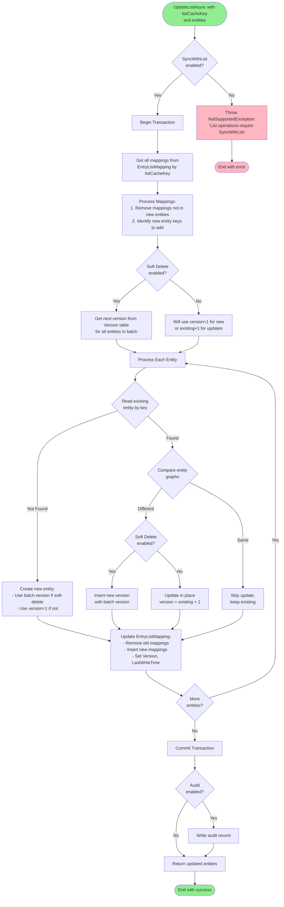

**Key Implementation Details:**

1. **SyncWithList Validation**: Ensures the entity type has SyncWithList enabled before proceeding.

2. **Mapping Synchronization**:
   - Retrieves all existing mappings for the listCacheKey
   - Removes mappings for entities not in the update set
   - Identifies new entities to be added to the list

3. **Version Management**:
   - **Soft Delete Enabled**: All entities in the batch get the same new version from Version table
   - **Soft Delete Disabled**: New entities get version=1, existing entities get version+1

4. **Entity Processing**:
   - **New Entity**: Creates with appropriate version based on soft-delete setting
   - **Existing Entity - No Changes**: Skips update if object graphs are identical
   - **Existing Entity - Changes**: Updates with new version

5. **Object Graph Comparison**:
   - Performs deep comparison of entity using CompareLogic (from nupkg CompareNETObjects).
   - Only updates when actual changes are detected
   - Skips version field comparison

6. **Update Strategy**:
   - **Soft Delete Enabled**: Inserts new version (immutable history)
   - **Soft Delete Disabled**: Updates in place with incremented version

7. **EntryListMapping Updates**:
   - Removes mappings for deleted entities
   - Updates existing mappings with new versions
   - Adds new mappings for new entities

8. **Transaction Scope**: All operations occur within a single transaction ensuring atomicity.

9. **Note on Version Checking**: Unlike single entity updates, list updates skip version matching since the entire list is being replaced as a unit.

##### 5.2.4.4 Delete Operation

The `DeleteListAsync` operation removes the list mapping entries without affecting the underlying entities, maintaining referential independence between lists and entities.

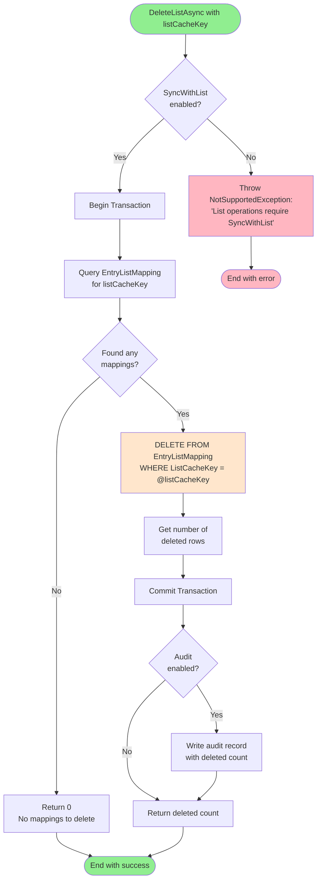

**Key Implementation Details:**

1. **SyncWithList Validation**: Ensures the entity type has SyncWithList enabled before proceeding.

2. **List-Only Deletion**:
   - Only removes entries from the EntryListMapping table
   - Does NOT touch or delete any entities in the entity table
   - Entities remain available for other lists or direct access

3. **Operation Scope**:
   - Deletes all mappings where ListCacheKey matches the provided key
   - Returns the count of deleted mapping entries

4. **Entity Preservation**:
   - Entities continue to exist independently
   - Can still be accessed directly or through other lists
   - Maintains referential independence

5. **Transaction Scope**: Deletion occurs within a transaction for consistency.

6. **Audit Trail**: Optional audit record captures the list deletion operation.

**Important Design Considerations:**

- **No Cascade Delete**: Deleting a list does not cascade to entities, preserving data integrity
- **List Independence**: Lists are treated as views or collections of references, not owners of entities
- **Performance**: Simple DELETE operation on mapping table is fast and efficient
- **Idempotent**: Deleting a non-existent list returns 0 without error


#### 5.2.5 Bulk Import/Export Behavior

The persistence layer provides bulk import/export capabilities for data migration, archival, and purge operations. These operations support both full and incremental data transfers with version-aware semantics.

##### 5.2.5.1 Export Operation

The bulk export operation extracts entities with full metadata preservation:

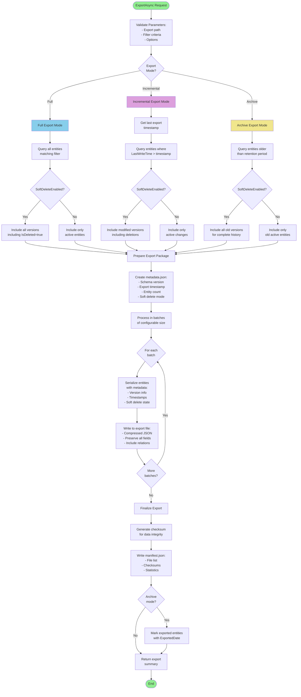

##### 5.2.5.2 Import Operation

The bulk import operation supports merge strategies and conflict resolution:

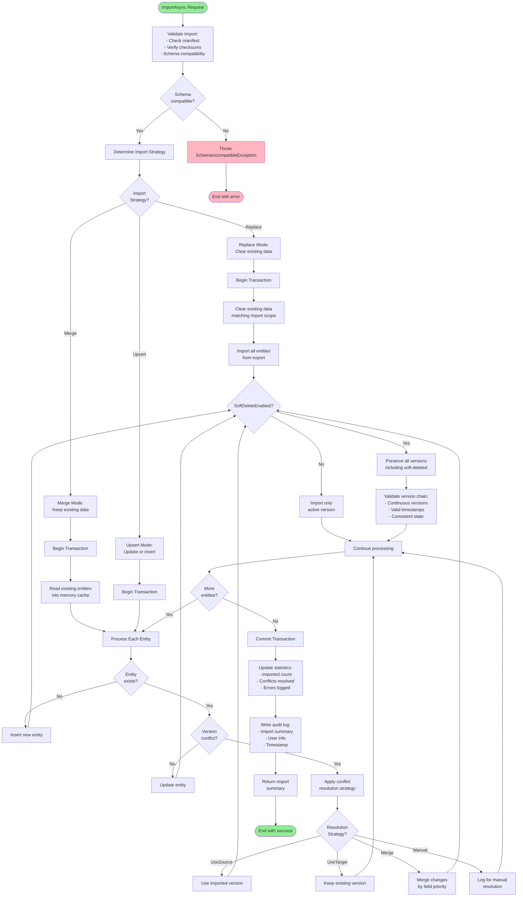

##### 5.2.5.3 Data Purge Operation

The purge operation permanently removes data based on retention policies:

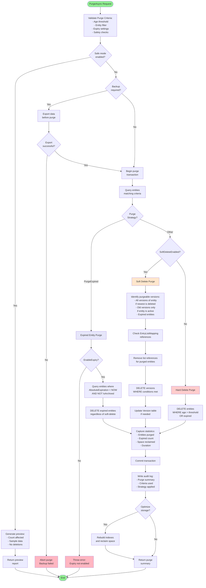

##### 5.2.5.4 Implementation Considerations

**Export Features:**
- **Compression**: Use GZIP compression for large exports
- **Streaming**: Stream data to avoid memory issues with large datasets
- **Partitioning**: Split large exports into multiple files
- **Encryption**: Optional encryption for sensitive data exports
- **Progress Tracking**: Report progress for long-running operations

**Import Features:**
- **Validation**: Pre-import validation to catch issues early
- **Rollback**: Transaction support for atomic imports
- **Transformation**: Support for data transformation during import
- **Parallel Processing**: Multi-threaded import for performance
- **Duplicate Detection**: Configurable duplicate handling strategies

**Purge Safety:**
- **Dry Run**: Always support preview mode before actual deletion
- **Audit Trail**: Comprehensive logging of all purge operations
- **Approval Workflow**: Optional approval requirements for large purges
- **Recovery Window**: Grace period before physical deletion
- **Performance Impact**: Batch processing to minimize system impact
- **Expiry Support**: Special handling for entities with AbsoluteExpiration when EnableExpiry is true

**Version Handling:**
- **Version Chain Integrity**: Maintain consistency in version sequences
- **Soft Delete Awareness**: Properly handle soft-deleted entities
- **Reference Counting**: Track entity usage before purging
- **Cascade Options**: Configurable cascade behavior for related data

### 5.3 Benefits of Attribute-Driven Architecture

The attribute-driven design provides significant advantages:

1. **Zero Boilerplate Code**
   - No manual SQL writing
   - No mapping code required
   - CRUD operations automatically generated

2. **Type Safety**
   - Compile-time validation of SQL types
   - Strong typing throughout the stack
   - IntelliSense support for attributes

3. **Consistency**
   - Uniform schema generation
   - Standardized CRUD patterns
   - Predictable behavior across entities

4. **Maintainability**
   - Schema changes through attribute updates
   - Single source of truth (entity class)
   - Easy to understand and modify

5. **Flexibility**
   - Per-entity soft-delete configuration
   - Custom indexes and constraints
   - Extensible attribute system


### 5.4 Table Attribute Validation

The persistence layer provides validation mechanisms to ensure entity classes are properly configured based on their `[Table]` attribute settings.

#### 5.4.1 Validation Requirements

The `[Table]` attribute supports several configuration options that require specific properties to be present on the decorated class:

1. **SoftDeleteEnabled** - When `true`, requires a `IsDeleted` flag and Version is tracked globally, entity is never physically removed from table and we can observe changing history; When `false`, `Version` property is only used for concurrency control (default to `false`)
2. **ExpirySpan** - When set (not null), requires:
   - `CreationTime` property of type `DateTimeOffset` or `DateTimeOffset?`
   - `AbsoluteExpiration` property of type `DateTimeOffset` or `DateTimeOffset?`
   - The persistence layer will automatically set `AbsoluteExpiration = CreationTime + ExpirySpan`
3. **EnableArchive** - When `true` (and `ExpirySpan` is set), requires an `IsArchived` property of type `bool`

#### 5.4.2 Validation Approaches

##### Using Validation Attributes

Apply validation attributes to classes that need compile-time or runtime validation:

```csharp
[Table("MyEntity", SoftDeleteEnabled = true)]
[TableSoftDeleteValidation]
public class MyEntity : BaseEntity<string>, IVersionedEntity<string>
{
    public long Version { get; set; }
    public bool IsDeleted { get; set; }
    public string Name { get; set; }
}

[Table("CacheEntry", ExpirySpanString = "1.00:00:00")] // 1 day expiry
[TableExpirationValidation]
public class CacheEntry : BaseEntity<string>
{
    public DateTimeOffset CreationTime { get; set; }
    public DateTimeOffset AbsoluteExpiration { get; set; }
    public string Data { get; set; }
}
```

##### Using Static Validators

For programmatic validation at runtime or in unit tests:

```csharp
// Validate a single type
try
{
    TableSoftDeleteValidator.ValidateType(typeof(MyEntity));
}
catch (InvalidOperationException ex)
{
    // Handle validation error
    Console.WriteLine($"Validation failed: {ex.Message}");
}

// Check if a type is valid (no exceptions)
bool isValid = TableSoftDeleteValidator.IsTypeValid(typeof(MyEntity));

// Validate an entire assembly
try
{
    TableSoftDeleteValidator.ValidateAssembly(typeof(MyEntity).Assembly);
}
catch (AggregateException ex)
{
    foreach (var error in ex.InnerExceptions)
    {
        Console.WriteLine($"Validation error: {error.Message}");
    }
}
```

##### Using DataAnnotations

```csharp
// Create an instance and validate
var entity = new MyEntity { Id = "123", Name = "Test" };
var validationContext = new ValidationContext(entity);
var validationResults = new List<ValidationResult>();

bool isValid = Validator.TryValidateObject(entity, validationContext, validationResults, true);

if (!isValid)
{
    foreach (var result in validationResults)
    {
        Console.WriteLine($"Validation error: {result.ErrorMessage}");
    }
}
```

#### 5.4.3 Common Validation Errors

1. **Missing Version Property**
   ```
   Type 'MyEntity' has [Table] attribute with SoftDeleteEnabled=true but does not have a Version property.
   ```
   **Solution**: Add a `public long Version { get; set; }` property or inherit from `BaseEntity<T>`.

2. **Wrong Version Type**
   ```
   Type 'MyEntity' has Version property but it is of type 'Int32' instead of 'System.Int64'.
   ```
   **Solution**: Change the Version property type to `long`.

3. **Missing Expiration Properties**
   ```
   Type 'MyEntity' has [Table] attribute with ExpirySpan set but does not have a CreationTime property.
   ```
   **Solution**: Add both `CreationTime` and `AbsoluteExpiration` properties of type `DateTimeOffset`.

#### 5.4.4 Best Practices

1. **Inherit from BaseEntity**: Most entities should inherit from `BaseEntity<T>` which already includes a proper Version property.

2. **Disable Soft Delete When Not Needed**: If your entity doesn't need versioning:
   ```csharp
   [Table("MyEntity", SoftDeleteEnabled = false)]
   public class MyEntity : BaseEntity<string>
   {
       [NotMapped]
       public new long Version { get; set; }  // Hide the inherited Version
   }
   ```

3. **Configure Expiration Properly**:
   ```csharp
   [Table("CacheEntry", SoftDeleteEnabled = true, ExpirySpanString = "1.00:00:00")]
   public class CacheEntry<T> : BaseEntity<string>, IVersionedEntity<string>
   {
       public long Version { get; set; }
       public bool IsDeleted { get; set; }
       public DateTimeOffset CreationTime { get; set; }
       public DateTimeOffset AbsoluteExpiration { get; set; }
       public T Value { get; set; }

       public bool IsExpired => DateTimeOffset.UtcNow > AbsoluteExpiration;
   }
   ```

4. **Add Build-Time Validation**: Include assembly validation in your unit tests to catch issues early:
   ```csharp
   [TestClass]
   public class EntityValidationTests
   {
       [TestMethod]
       public void AllEntities_ShouldHaveRequiredProperties()
       {
           // This will throw if any entity is invalid
           TableSoftDeleteValidator.ValidateAssembly(typeof(BaseEntity<>).Assembly);

           // Also validate expiration properties
           var expirationResults = TableExpirationValidationAttribute.ValidateAssembly(typeof(BaseEntity<>).Assembly);
           Assert.AreEqual(0, expirationResults.Length, "Some entities have invalid expiration configuration");
       }
   }
   ```

## 6. Implementation Plan

### Implementation Timeline (Updated: 2025-07-30)

The following timeline shows the current implementation status and remaining work:

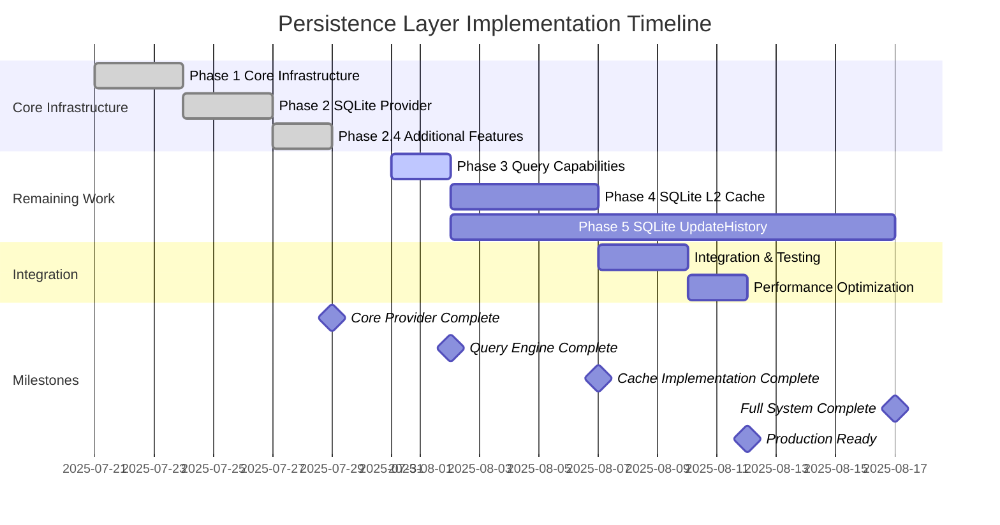

#### Implementation Progress Summary

**✅ Completed (Phase 1-2):**
- Core infrastructure with interfaces and contracts
- SQLite persistence provider with full CRUD operations
- Batch operations for efficient bulk processing
- Transaction management with rollback support
- Bulk import/export with progress tracking
- List operations for managing entity collections
- Version management and soft delete support
- Basic query capabilities with predicate support

**🔄 In Progress (Phase 3):**
- Advanced query translation and optimization
- Complex predicate support
- Query performance monitoring

**📋 Planned (Phase 4-5):**
- SQLite as L2 cache implementation
- UpdateHistory store for historical data
- Performance optimization and production hardening

#### Additional Features Not in Original Plan

The following features were implemented but not originally planned in the design document:

1. **Bulk Import/Export Operations**:
   - Full-featured bulk import with multiple strategies (Replace, Merge, Skip)
   - File-based import with manifest support
   - Bulk export with filtering and multiple modes
   - Progress tracking for long-running operations
   - Compressed export support

2. **Advanced Transaction Support**:
   - TransactionScope with automatic disposal behavior
   - TransactionalOperation with event hooks
   - Support for chaining operations within transactions

3. **List Operations**:
   - Complete list management API for entity collections
   - EntryListMapping table for efficient associations
   - Support for list-based caching scenarios

4. **Purge Operations**:
   - Purge support with backup capabilities
   - Configurable purge strategies
   - Integration with bulk export for data preservation

These additions significantly enhance the persistence layer's capabilities beyond the original scope, providing a more comprehensive solution for data management needs.

#### Parallel Implementation Benefits

1. **Resource Utilization**: Two teams can work independently on cache and history implementations
2. **Shared Components**: Both implementations use common SQLite infrastructure from Phase 1-3
3. **Risk Mitigation**: Issues in one implementation don't block the other
4. **Faster Delivery**: Total implementation time reduced from 10 days sequential to 5 days parallel

#### Implementation Dependencies

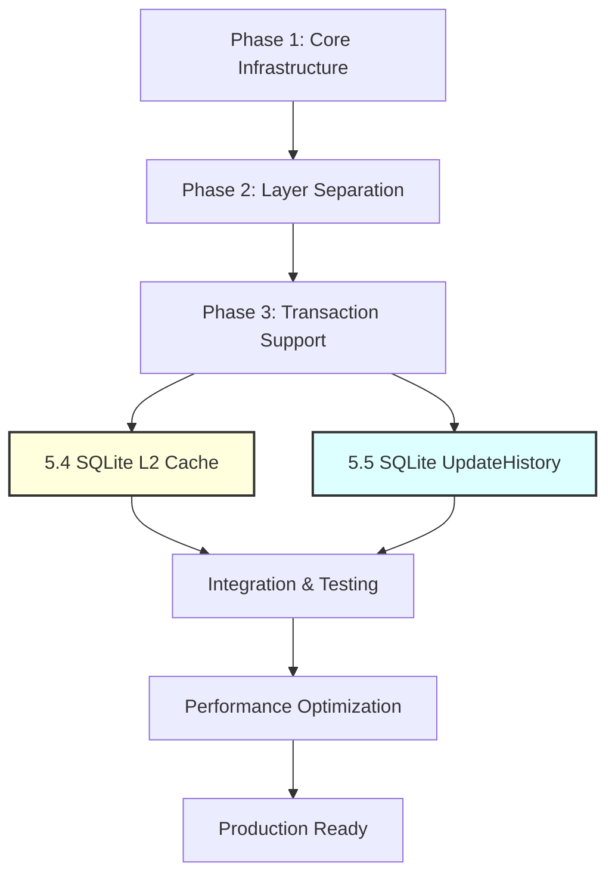

### 6.1 Phase 1: Core Infrastructure (Days 1-3) ✅ COMPLETED

#### 6.1.1 Implementation Tasks
- [x] Define base interfaces and contracts (`IEntity<TKey>`, `IPersistenceProvider<T,TKey>`)
- [x] Implement tracking field management in `BaseEntity<TKey>`
- [x] Create generic repository base class with common CRUD operations
- [x] Implement cluster-aware service initialization with retry logic and lock file
- [x] Design and implement serialization abstraction (`ISerializer`)
- [x] Create caller information tracking (`CallerInfo`)
- [x] Add transaction support interfaces (`ITransactionScope`, `ITransactionalOperation`)
- [x] Add bulk operation contracts (`BulkImportOptions`, `BulkExportOptions`, `BulkOperationProgress`)

#### 6.1.2 Deliverables
- [x] Core contracts assembly (`Common.Persistence.Contracts`)
- [x] Base entity implementations with tracking fields
- [x] Serialization providers (JSON and DataContract)
- [x] Transaction and bulk operation contracts
- [x] Entity mapping attributes and interfaces
- [x] Unit tests for base functionality
- [x] Design documentation

#### 6.1.3 Unit Test Scenarios
1. **Entity Tracking Tests**:
   - [ ] Verify `CreatedTime` is set on entity creation
   - [ ] Verify `LastWriteTime` updates on modification
   - [ ] Verify `Version` increments correctly
   - [ ] Test `IsDeleted` soft delete functionality

2. **Serialization Tests**:
   - [ ] Test JSON serialization/deserialization roundtrip
   - [ ] Test DataContract serialization compatibility
   - [ ] Verify handling of null values and empty collections
   - [ ] Test serialization of complex nested objects

3. **Base Entity Tests**:
   - [ ] Test equality comparison based on Id
   - [ ] Test GetHashCode implementation
   - [ ] Verify tracking field immutability rules

See [Appendix C: Core Persistence Contracts](persistence_appendix_c_core_contracts.md) for the C# interface definitions.

### 6.2 Phase 2: SQLite Persistence Provider (Days 4-6) 🔄 MOSTLY COMPLETED

#### 6.2.1 Implementation Tasks
- [x] Implement `SQLitePersistenceProvider<T,TKey>` class
- [x] Create attribute-based schema mapping system
- [x] Implement SQL generation for CRUD operations
- [x] Add connection management with async support
- [x] Implement batch operations (CreateAsync, UpdateAsync, DeleteAsync with batches)
- [x] Implement bulk import/export operations (BulkImportAsync, BulkExportAsync)
- [x] Create SQLite configuration with JSON file support
- [x] Add transaction support with TransactionScope and TransactionalOperation
- [x] Implement list operations (CreateListAsync, UpdateListAsync, GetListAsync, DeleteListAsync)
- [ ] Create SQLite configuration with hot reload support
- [ ] Add performance counters and ETW tracing

#### 6.2.2 Deliverables
- [x] SQLite persistence provider assembly (`Common.Persistence.Provider.SQLite`)
- [x] Entity mapping attributes (`TableAttribute`, `ColumnAttribute`, etc.)
- [x] SQL expression translator for LINQ queries
- [x] Configuration management system (SqliteConfiguration)
- [x] Transaction management implementation
- [x] Bulk operation support with progress tracking
- [x] Version management with global sequence
- [x] EntryListMapping for list-to-entry associations
- [ ] Failover and retry mechanism
- [x] Unit and integration tests (partial coverage)

#### 6.2.3 Unit Test Scenarios
1. **CRUD Operation Tests**:
   - [x] Test single entity Create with auto-generated keys
   - [x] Test Read by primary key
   - [x] Test Update with version checking
   - [x] Test soft Delete
   - [x] Verify tracking fields update correctly

2. **Batch Operation Tests**:
   - [x] Test batch insert of multiple entities
   - [x] Test batch update with transaction support
   - [x] Test batch delete operations
   - [x] Verify transaction rollback on failure

3. **Query Translation Tests**:
   - [x] Test LINQ to SQL translation for Where clauses
   - [x] Test OrderBy, Skip, Take for pagination
   - [x] Test complex predicate combinations (AND/OR)
   - [x] Test null value comparisons
   - [x] Test string operations (Contains, StartsWith)

4. **Schema Generation Tests**:
   - [x] Test table creation from entity attributes
   - [x] Test index creation (clustered and non-clustered)
   - [x] Test foreign key constraint generation
   - [x] Test check constraint validation

5. **Concurrency Tests**:
   - [x] Test optimistic concurrency with version conflicts
   - [x] Test concurrent updates to same entity
   - [x] Test deadlock detection and retry
   - [x] Test connection pool exhaustion scenarios

See [Appendix D: Transaction Management](persistence_appendix_d_transaction_management.md) for the ITransactionScope and ITransactionalOperation implementations.

See [Appendix E: SQLitePersistenceProvider Implementation](persistence_appendix_e_implementation.md) for the C# implementation showing how CRUD operations are translated to SQL statements with parameters.

#### 6.2.4 Additional Implemented Features

1. **Transaction Management**:
   - [x] `TransactionScope<T,TKey>` implementation with automatic commit/rollback
   - [x] `TransactionalOperation<TInput,TOutput>` for command pattern operations
   - [x] Support for mixed operations (INSERT, UPDATE, DELETE) in single transaction
   - [x] Event hooks for before/after commit and rollback
   - [x] Automatic rollback on disposal if not explicitly committed

2. **Bulk Operations**:
   - [x] `BulkImportAsync` with configurable import strategies (Replace, Merge, Skip)
   - [x] `BulkImportFromFileAsync` for file-based imports with manifest support
   - [x] `BulkExportAsync` with filtering and export modes (Full, Incremental, Archive)
   - [x] Progress tracking with `IProgress<BulkOperationProgress>`
   - [x] Export manifest generation with metadata
   - [x] Support for compressed exports

3. **List Operations**:
   - [x] `CreateListAsync` to associate multiple entities with a list key
   - [x] `GetListAsync` to retrieve all entities associated with a list key
   - [x] `UpdateListAsync` to update entities in a list
   - [x] `DeleteListAsync` to remove all entities in a list
   - [x] `EntryListMapping` table for efficient list-to-entry associations

4. **Advanced Features**:
   - [x] Version management with global sequence table
   - [x] Audit trail support when `EnableAuditTrail=true`
   - [x] Soft delete with version history
   - [x] Entity expiration support with `IExpirableEntity`
   - [x] Archive support with `IArchivableEntity`
   - [x] Purge operations with backup support

### 6.3 Phase 3: SQLite Query Capabilities (Days 7-8) 🔄 MOSTLY COMPLETED

#### 6.3.1 Implementation Tasks
- [x] Implement `SQLiteExpressionTranslator` for LINQ expressions
- [ ] Add support for complex predicates (nested AND/OR)
- [x] Implement pagination with efficient OFFSET/LIMIT

#### 6.3.2 Deliverables
- [x] Enhanced query API with fluent interface
- [x] Expression tree visitor for SQL generation
- [x] Unit and performance tests

#### 6.3.3 Unit Test Scenarios
1. **Expression Translation Tests**:
   - [x] Test method call translations (Contains, Any, All)
   - [x] Test null propagation in expressions
   - [x] Test date/time comparison operations
   - [x] Test enum value comparisons

2. **Complex Query Tests**: Not supported

3. **Edge Case Tests**:
   - [x] Test empty result sets
   - [x] Test single result expectations
   - [x] Test timeout handling
   - [x] Test SQL injection prevention
   - [ ] Test parameter limit handling (SQLite limit: 999)

**Deliverables**: Enhanced query API, performance benchmarks, cluster query tests

### 6.4 Phase 4: SQLite as L2 Cache (Days 9-12)

#### 6.4.1 Implementation Tasks
- [ ] Implement `SQLiteCacheProvider<T>` with `ICacheProvider<T>` interface
- [ ] Create `CacheEntry<T>` wrapper with metadata
- [ ] Implement cache expiration policies (absolute and sliding)
- [ ] Add cache statistics collection and reporting
- [ ] Enable audit trail for cache operations using unified `Audit` table
- [ ] Implement cache warming and preloading
- [ ] Add distributed cache invalidation support
- [ ] Create data migration tools between storage providers

#### 6.4.2 Deliverables
- [ ] SQLite cache provider implementation
- [ ] Cache configuration API with hot reload
- [ ] Migration tools and scripts
- [ ] Cache statistics dashboard
- [ ] Audit trail reporting
- [ ] Performance benchmarks
- [ ] Unit and integration tests

#### 6.4.3 Unit Test Scenarios
1. **Cache Operation Tests**:
   - [ ] Test cache Get/Set with various data types
   - [ ] Test cache expiration (absolute time)
   - [ ] Test sliding expiration renewal
   - [ ] Test cache eviction policies
   - [ ] Test cache key collision handling

2. **Cache Metadata Tests**:
   - [ ] Test metadata extraction for different entity types
   - [ ] Test tag-based cache queries
   - [ ] Test cache entry versioning
   - [ ] Test cache size calculation
   - [ ] Test priority-based eviction

3. **Concurrency Tests**:
   - [ ] Test concurrent cache reads/writes
   - [ ] Test cache stampede prevention
   - [ ] Test distributed lock mechanisms
   - [ ] Test cache coherency across nodes
   - [ ] Test race condition handling

4. **Performance Tests**:
   - [ ] Test cache hit/miss ratios
   - [ ] Test large object caching (1-20MB)
   - [ ] Test cache warm-up performance
   - [ ] Test bulk cache operations
   - [ ] Test memory pressure scenarios

5. **Migration Tests**:
   - [ ] Test data migration from file cache to SQLite
   - [ ] Test migration rollback scenarios
   - [ ] Test zero-downtime migration
   - [ ] Test data integrity validation
   - [ ] Test migration progress tracking

#### 6.4.4 Cache Schema Overview

See [Appendix A: SQLite Cache Schema](persistence_appendix_a_sqlite_cache_schema.md) for the complete SQL schema definition, including [Section A.5](persistence_appendix_a_sqlite_cache_schema.md#a5-cacheentryt-storage-details) which details how `CacheEntry<T>` objects are stored in the CacheEntry table.

**Note**: The CacheEntry table uses soft-delete (SoftDeleteEnabled = true), resulting in a composite primary key (CacheKey, Version). This enables full version history and audit trail for cache entries.

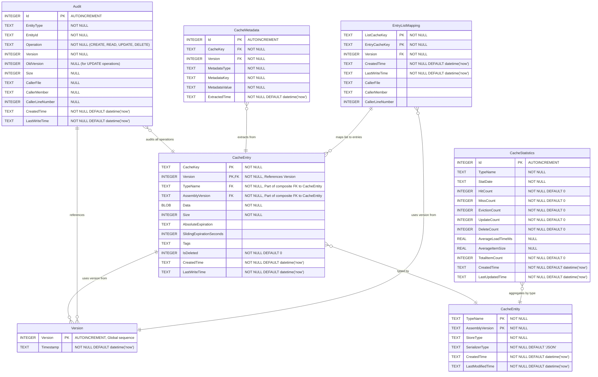

#### 6.4.5 Schema Relationships and Version Management

- **Global Version Sequence**: The `Version` table maintains a global auto-incrementing sequence used across all cache operations
- **Unified Audit Table**: The `Audit` table (defined in Contracts project as `AuditRecord` entity) provides a single audit trail for all entities when `EnableAuditTrail=true` is set on the `[Table]` attribute
- **CacheEntry Versioning**:
  - Each entry has a composite primary key (Key, Version) allowing multiple versions of the same key
  - Single table for multiple entity types, with TypeName column for filtering by type
  - When an entry is updated, a new version is created from the global sequence
  - The version acts as an ETag for optimistic concurrency control
  - Composite primary key (Key, Version) ensures unique versioning per cache key
  - Updates are blocked if the provided version doesn't match the latest version in the table
- **Generic CacheEntry<T> Storage**:
  - The generic `CacheEntry<T>` wrapper (documented in [Appendix C](persistence_appendix_c_core_contracts.md#c3-cache-entry-wrapper)) is stored in the CacheEntry table
  - The `Data` column stores the serialized `CacheEntry<T>` object as a byte array (BLOB)
  - The serialization includes the wrapped value of type T, metadata, and expiration settings
  - The `TypeName` column stores the actual type name of T (e.g., "UpdateEntity", "UpdateRun")
  - The `AssemblyVersion` column tracks the assembly version for type evolution support
- **Audit Trails** (when `EnableAuditTrail=true`):
  - `Audit` table tracks all CRUD operations (CREATE, READ, UPDATE, DELETE) with version tracking
  - Unified audit table for all entity types, including cache entries
  - References the global version sequence for consistency
  - Tracks caller information (file, method, line number) for debugging
  - `CacheStatistics` aggregates daily performance metrics by TypeName for monitoring and capacity planning
- **Optimistic Concurrency Control**:
  - Clients must provide the current version when updating an entry
  - If the version doesn't match the latest in the database, the update is rejected
  - This prevents lost updates in concurrent scenarios
- **Metadata**:
  - extracts searchable tags from cached entities based on their type for advanced querying (this can be discovered update manifest, or update itself)
  - stores current snapshot for each entity type and cachekey
  - do not store deleted entities, only current version
  - when cache key is a hash from query parameters, such as resover context, json is stored as a separate field in the metadata table
- **EntryListMapping**:
  - Maps list cache keys (e.g., query results) to individual entry cache keys
  - Enables efficient retrieval of all entries belonging to a cached list
  - Supports list invalidation and query result caching
  - Uses composite primary key (ListCacheKey, EntryCacheKey) for unique mappings
  - Physical delete only (no soft delete support)
  - Version field represents the version when the list was created
  - Individual entries may be updated independently after list creation, so their current versions in the main entity table may differ from the version stored in this mapping
- **EntityType**:
  - `CacheEntity` table stores metadata about each entity type, its serialization type and store type associated with deployed version.
  - Used for data migration and schema evolution (note: the logic can be complex and should move to separate design doc)

#### 6.4.6 Metadata Extraction Patterns

The `CacheMetadata` table enables powerful search capabilities by extracting type-specific tags from cached entities:

**Update Entity Metadata:**
- MetadataType: "Update"
- Tags:
  - `PackageType`: (e.g., "Solution")
  - `Version`: (e.g., "1.2504.1.1")
  - `PackageArtifact`: (e.g., "Solution1.2504.1.1.zip")
  - `Dependencies`: (e.g., "Service.1.2411")
  - `Publisher`: (e.g., "Microsoft Corporation")
  - `ReleaseDate`: (e.g., "2024-03-15")

**UpdateRun Entity Metadata:**
- MetadataType: "UpdateRun"
- Tags:
  - `ActionPlanId`: (e.g., "AP-12345678-90ab-cdef")
  - `Status`: (e.g., "InProgress", "Completed", "Failed")
  - `StartTime`: (e.g., "2024-03-20T10:00:00Z")
  - `UpdateVersion`: (e.g., "Solution1.2504.1.1")

**UpdateLocation Entity Metadata:**
- MetadataType: "UpdateLocation"
- Tags:
  - `LocationName`: (e.g., "redmond")
  - `CurrentVersion`: (e.g., "12.2508.1001.5180")
  - `PackageVersion`: (e.g., "Solution=12.2508.1001.5180, Services=99.9999.9.11, SBE=4.0.0.0")
  - `HealthStatus`: (e.g., "Success", "Warning", "Critical")
  - `LastHealthCheck`: (e.g., "2024-03-20T09:30:00Z")
  - `ApplicableVersions`: (e.g., "2.1.2403.0;2.1.2404.0")
  - `State`: (e.g., "AppliedSuccessfully")

#### 6.4.7 Version-Based Concurrency Control

The persistence layer uses entity versions as ETags for optimistic concurrency control:

**CREATE Operation**:
1. First checks if an entity with the same key already exists
2. If found and `IsDeleted = false`, throws `EntityAlreadyExistsException`
3. If not found or `IsDeleted = true`, creates new entity with new version from global sequence
4. This prevents accidental overwrites of existing data

**UPDATE Operation**:
1. Client must provide the entity with its current version
2. Update SQL includes `WHERE Version = @originalVersion AND IsDeleted = 0`
3. If no rows affected (version mismatch or entity deleted), throws `ConcurrencyException`
4. On success, entity gets new version from global sequence
5. This prevents lost updates in concurrent scenarios

**Example Scenario**:
```
Client A reads entity (Version=5)
Client B reads entity (Version=5)
Client A updates entity (Version→6)
Client B attempts update with Version=5 → ConcurrencyException
```

This ensures data consistency without requiring pessimistic locking, allowing better scalability in multi-node environments.

#### 6.4.8 Deliverables Checklist
- [ ] SQLite cache provider with full ICacheProvider implementation
- [ ] Unified audit trail using `Audit` table for all operations
- [ ] Cache statistics and monitoring
- [ ] Data migration utilities
- [ ] Comprehensive unit test suite (90%+ coverage)
- [ ] Integration tests with failover scenarios
- [ ] Performance benchmark report
- [ ] Operations runbook

### 6.5 Phase 5: Update History Store (Days 9-30)

> note: detailed design and implementation for this feature is in separate doc.

#### 6.5.1 Implementation Tasks
- [ ] Implement Update and UpdateRun entities with table schema attributes
- [ ] Create UpdateHttpClient, it should be able to get cert to authenticate, call controllers, and able to parse returned json to Update/UpdateRun entities
- [ ] Implement UpdateServiceClient, which is created by UpdateServiceClientFactory, including failover service resolver integration, this is optional and used to call UpdateService API endpoints outside update service.
- [ ] Implement a query parameter (since=1d|2h|3w) for both update and updateRun, use it to filter and return recent data
- [ ] Implement UpdateHistoryRepository, which uses SQLitePersistenceProvider<UpdateEntity, string> and SQLitePersistenceProvider<UpdateRunEntity, string> to store update history data
- [ ] Implement UpdateHistoryAdmin, which is used to query QoS telemetry, lastSyncTime, syncHistory, reset, purge old data, etc. The functionalities are exposed via UpdateHistoryController
- [ ] Create timer job, that calls update api using UpdateHttpClient, without `since` query parameter to read all data, write to UpdateHistoryStore, keep track of last successful write timestamp (a query from UpdateHistoryRepository), then use `since` query parameter each following call to return delta, for cache-to-history synchronization
- [ ] Once update history store is populated, change Update API behavior to return both current and historical data, current StampVersion to determine if current update is read from backend, or from UpdateHistoryStore

#### 6.5.2 Deliverables
- [ ] Entity classes, UpdateHistory database schema and migration scripts
- [ ] UpdateHttpClient with retry and failover logic
- [ ] Timer job for background synchronization
- [ ] UpdateHistory API endpoints
- [ ] Data retention and cleanup jobs
- [ ] Unit and integration tests
- [ ] Update API to support `since` query parameter, and return both current and historical data

#### 6.5.3 Unit Test Scenarios
1. **Schema Tests**:
   - [ ] Test UpdateHistory table constraints
   - [ ] Test Step hierarchy parent-child relationships
   - [ ] Test composite primary keys
   - [ ] Test foreign key cascading
   - [ ] Test index performance

2. **Synchronization Tests**:
   - [ ] Test timer job execution and scheduling
   - [ ] Test incremental sync (last 12 hours)
   - [ ] Test full sync (180 days)
   - [ ] Test sync failure recovery
   - [ ] Test duplicate prevention

3. **API Tests**:
   - [ ] Test /updateHistory endpoint responses
   - [ ] Test pagination and filtering
   - [ ] Test sort order and date ranges
   - [ ] Test combined current + historical data
   - [ ] Test API versioning compatibility

4. **Step Hierarchy Tests**:
   - [ ] Test recursive step structure storage
   - [ ] Test step depth calculation
   - [ ] Test display order maintenance
   - [ ] Test step data serialization
   - [ ] Test large hierarchy performance (1000+ steps)

5. **Retention Policy Tests**:
   - [ ] Test 180-day retention enforcement
   - [ ] Test "last 4 updates" fallback
   - [ ] Test cleanup job execution
   - [ ] Test data archival process
   - [ ] Test retention policy changes

#### 6.5.4 Update History Schema

See [Appendix B: UpdateHistory SQLite Schema](persistence_appendix_b_updatehistory_schema.md) for the complete SQL schema definition.

**Note**: The UpdateHistory and Update tables do not use Version field (SoftDeleteEnabled = false) for storage efficiency. These tables don't require version history as they already represent historical data.


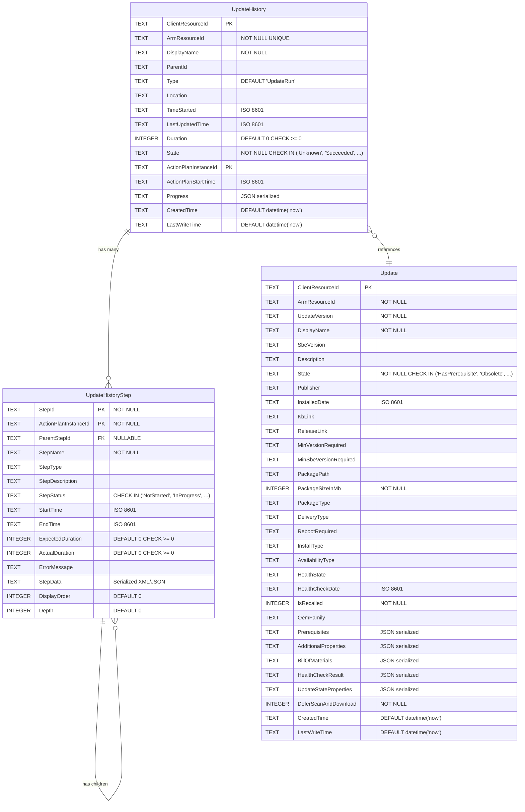

__Schema Design Notes:__

1. **UpdateHistory** (Main Table):
   - Primary entity storing update run information
   - Composite primary key: (ClientResourceId, ActionPlanInstanceId)
   - Includes resource identification from BaseResourceProperties
   - Contains denormalized progress information for query performance
   - Indexed on ArmResourceId, TimeStarted, State, and CreatedTime

2. **UpdateHistoryStep** (Detail Table):
   - Stores individual step execution details with recursive structure
   - Composite primary key: (StepId, ActionPlanInstanceId)
   - Supports parent-child relationships via ParentStepId for nested steps
   - Links to UpdateHistory via ActionPlanInstanceId
   - Captures timing, status, and error information per step
   - Includes StepData blob field for serialized step information (XML/JSON)
   - Maintains DisplayOrder and Depth for hierarchical presentation

3. **Update** (Reference Table):
   - Stores update package information
   - Primary key: ClientResourceId
   - Contains update metadata, state, and configuration details


#### 6.5.5 Step Model Implementation Notes:

The Step structure in UpdateRun (defined in `src\UpdateResourceProvider\UpdateService\Models\Step.cs`) is recursive, where each Step can contain child Steps[]. This hierarchical structure is preserved in the UpdateHistoryStep table through:

1. **ParentStepId**: Links child steps to their parent step
2. **Depth**: Indicates nesting level (0 for root steps, increments for each level)
3. **DisplayOrder**: Maintains the order of steps within the same parent
4. **StepData (BLOB)**: Stores serialized Step object as XML string, preserving:
   - Complete step configuration
   - Properties specific to step types
   - Any custom attributes or metadata

Example Step Hierarchy:
```
UpdateRun
├── Step 1: "Prepare Update" (Depth=0, DisplayOrder=1)
│   ├── Step 1.1: "Download Package" (Depth=1, DisplayOrder=1)
│   └── Step 1.2: "Validate Package" (Depth=1, DisplayOrder=2)
├── Step 2: "Apply Update" (Depth=0, DisplayOrder=2)
│   ├── Step 2.1: "Stop Services" (Depth=1, DisplayOrder=1)
│   ├── Step 2.2: "Install Components" (Depth=1, DisplayOrder=2)
│   │   ├── Step 2.2.1: "Install Component A" (Depth=2, DisplayOrder=1)
│   │   └── Step 2.2.2: "Install Component B" (Depth=2, DisplayOrder=2)
│   └── Step 2.3: "Start Services" (Depth=1, DisplayOrder=3)
└── Step 3: "Verify Update" (Depth=0, DisplayOrder=3)
```

#### 6.5.6 Deliverables Checklist
- [ ] UpdateHistory SQLite database with normalized schema
- [ ] Background synchronization timer job
- [ ] UpdateHistory API endpoints with pagination
- [ ] Update service client with failover support
- [ ] Step hierarchy visualization tools
- [ ] Comprehensive test suite
- [ ] Data retention and archival system

### 6.6 Phase 6: Production Readiness (Days 13-20)

#### 6.6.1 Implementation Tasks
- [ ] Merge PR to main branch after code review
- [ ] Deploy packages to PreProd/Lab environments
- [ ] Conduct performance tuning for CSV access patterns
- [ ] Optimize UpdateHistory query performance
- [ ] Implement monitoring and diagnostics dashboards
- [ ] Create operations documentation and runbooks
- [ ] Determine optimal configuration settings
- [ ] Execute data migration from existing systems

#### 6.6.2 Deliverables
- [ ] Production deployment packages
- [ ] Performance tuning report
- [ ] Monitoring dashboard with alerts
- [ ] Operations runbook
- [ ] Configuration best practices guide
- [ ] Migration verification report
- [ ] Go-live checklist

#### 6.6.3 Performance Optimization Tasks
1. **CSV Optimization**:
   - Tune SQLite page size for CSV storage
   - Optimize connection pool settings
   - Configure appropriate lock timeouts
   - Implement read-ahead caching
   - Test with realistic workloads

2. **Query Optimization**:
   - Analyze query execution plans
   - Add missing indexes based on usage
   - Implement query result caching
   - Optimize JOIN operations
   - Tune SQLite cache size

3. **Monitoring Setup**:
   - Configure ETW tracing
   - Set up performance counters
   - Create alert rules for failures
   - Implement health check endpoints
   - Configure log aggregation

4. **Load Testing**:
   - Test with 10K+ concurrent operations
   - Simulate node failover scenarios
   - Test sustained load for 24+ hours
   - Measure resource utilization
   - Identify bottlenecks

#### 6.6.4 Production Readiness Checklist
- [ ] All unit tests passing (90%+ coverage)
- [ ] Integration tests completed successfully
- [ ] Performance benchmarks met
- [ ] Security review completed
- [ ] Documentation reviewed and approved
- [ ] Monitoring and alerts configured
- [ ] Rollback plan documented
- [ ] Operations team trained

## 7. Test Strategy

### 7.1 Unit Tests

#### 7.1.1 Coverage Requirements
- **Target**: 90%+ code coverage for core logic
- **Critical Path**: 100% coverage for persistence operations
- **Test Naming**: Follow pattern `MethodName_Scenario_ExpectedBehavior`
- **Test Data**: Use builder pattern for test entity creation

#### 7.1.2 Core Persistence Tests
1. **Entity Lifecycle Tests**:
   ```csharp
   - [ ] CreateAsync_NewEntity_SetsTrackingFields
   - [ ] CreateAsync_ExistingEntity_ThrowsEntityAlreadyExistsException
   - [ ] UpdateAsync_ValidEntity_IncrementsVersion
   - [ ] UpdateAsync_ConcurrentUpdate_ThrowsConcurrencyException
   - [ ] DeleteAsync_ExistingEntity_SetsSoftDeleteFlag
   ```

2. **Tracking Field Tests**:
   ```csharp
   - [ ] Create_NewEntity_SetsCreatedTimeToUtcNow
   - [ ] Update_ExistingEntity_UpdatesLastWriteTime
   - [ ] Update_MultipleUpdates_VersionIncrementsSequentially
   - [ ] Delete_SoftDelete_PreservesTrackingFields
   ```

3. **Transaction Tests**:
   ```csharp
   - [ ] BeginTransaction_MultipleOperations_CommitsAtomically
   - [ ] BeginTransaction_OperationFails_RollsBackAllChanges
   - [ ] BeginTransaction_NestedTransactions_ThrowsNotSupportedException
   - [ ] CommitAsync_NoActiveTransaction_ThrowsInvalidOperationException
   ```

### 7.2 Integration Tests

#### 7.2.1 Infrastructure Tests
1. **CSV Storage Tests**:
   - [ ] Test SQLite database creation on CSV
   - [ ] Test concurrent access from multiple processes
   - [ ] Test file locking and timeout handling
   - [ ] Test performance with network latency
   - [ ] Test storage growth and fragmentation

2. **Failover Tests**:
   - [ ] Test service failover with active transactions
   - [ ] Test database recovery after node failure
   - [ ] Test lock release on process termination
   - [ ] Test data consistency after failover
   - [ ] Test performance during failover

3. **Large Payload Tests**:
   - [ ] Test 1MB entity storage and retrieval
   - [ ] Test 10MB entity with compression
   - [ ] Test 20MB entity boundary conditions
   - [ ] Test memory usage during bulk operations
   - [ ] Test streaming for large BLOBs

#### 7.2.2 Cache Integration Tests
1. **Cache Coherency**:
   - [ ] Test cache invalidation across nodes
   - [ ] Test cache warm-up on service start
   - [ ] Test cache expiration accuracy
   - [ ] Test cache size limits
   - [ ] Test eviction policy behavior

2. **Performance Tests**:
   - [ ] Test cache hit ratio > 80%
   - [ ] Test response time < 10ms for cache hits
   - [ ] Test throughput > 1000 ops/sec
   - [ ] Test memory efficiency
   - [ ] Test GC pressure under load

### 7.3 End-to-End Tests

#### 7.3.1 Cluster Scenarios
1. **Multi-Node Tests**:
   - [ ] Deploy to 4-node cluster
   - [ ] Test load distribution
   - [ ] Test node addition/removal
   - [ ] Test rolling updates
   - [ ] Test cluster-wide operations

2. **Update Flow Tests**:
   - [ ] Test complete update discovery flow
   - [ ] Test update application with persistence
   - [ ] Test update history synchronization
   - [ ] Test rollback scenarios
   - [ ] Test concurrent updates

3. **API Integration Tests**:
   - [ ] Test REST API with persistence
   - [ ] Test pagination with large datasets
   - [ ] Test filtering and sorting
   - [ ] Test error handling
   - [ ] Test API versioning

#### 7.3.2 Stress Tests
1. **Load Tests**:
   - [ ] 10K concurrent users
   - [ ] 1M entities in database
   - [ ] 24-hour sustained load
   - [ ] Memory leak detection
   - [ ] Connection pool exhaustion

2. **Chaos Tests**:
   - [ ] Random node failures
   - [ ] Network partition simulation
   - [ ] Storage failure injection
   - [ ] Clock skew testing
   - [ ] Resource starvation

### 7.4 Performance Tests

#### 7.4.1 Performance Benchmarks
| Operation | Size | Target | P95 | P99 |
|-----------|------|--------|-----|-----|
| Single Create | < 1KB | 20ms | 50ms | 100ms |
| Single Read | < 1KB | 10ms | 20ms | 50ms |
| Single Update | < 1KB | 20ms | 50ms | 100ms |
| Batch Create (100) | < 100KB | 200ms | 500ms | 1s |
| Large Entity | 1-20MB | 200ms | 500ms | 2s |
| Query (1000 results) | - | 100ms | 200ms | 500ms |
| Cache Hit | Any | 5ms | 10ms | 20ms |
| Failover Recovery | - | 30s | 45s | 60s |

#### 7.4.2 Scalability Tests
1. **Horizontal Scaling**:
   - [ ] Linear throughput increase with nodes (up to 4)
   - [ ] Consistent latency under load
   - [ ] Even load distribution
   - [ ] No hot spots

2. **Data Volume Tests**:
   - [ ] 10M entities performance
   - [ ] 1TB database size handling
   - [ ] Index performance at scale
   - [ ] Query plan optimization

3. **Concurrent Operations**:
   - [ ] 1000 concurrent reads
   - [ ] 100 concurrent writes
   - [ ] Mixed read/write workload
   - [ ] Lock contention measurement

### 7.5 Concurrency Tests

#### 7.5.1 Concurrency Scenarios
1. **Optimistic Locking Tests**:
   ```csharp
   - [ ] ConcurrentUpdate_SameEntity_LastWriteWins
   - [ ] ConcurrentUpdate_VersionMismatch_ThrowsConcurrencyException
   - [ ] ConcurrentDelete_WhileUpdating_HandlesGracefully
   - [ ] BatchUpdate_PartialConflict_ReportsFailedEntities
   ```

2. **Race Condition Tests**:
   - [ ] Test double-create prevention
   - [ ] Test read-modify-write patterns
   - [ ] Test cache stampede prevention
   - [ ] Test version increment atomicity
   - [ ] Test transaction isolation

3. **Deadlock Tests**:
   - [ ] Test deadlock detection
   - [ ] Test timeout handling
   - [ ] Test retry mechanisms
   - [ ] Test lock escalation
   - [ ] Test priority inversion

#### 7.5.2 Thread Safety Tests
1. **Multi-threaded Access**:
   - [ ] Parallel entity creation
   - [ ] Concurrent cache access
   - [ ] Thread-safe statistics
   - [ ] Connection pool safety
   - [ ] Async operation handling

2. **Resource Contention**:
   - [ ] Database connection limits
   - [ ] Memory pressure handling
   - [ ] CPU throttling behavior
   - [ ] I/O saturation response
   - [ ] Lock timeout tuning

## 8. Success Criteria

1. **Cluster Compatibility**: Seamless operation in failover cluster environment
2. **Performance Targets**: Meeting benchmarks with CSV storage
3. **High Availability**: Automatic failover with data consistency
4. **CSV Optimization**: Efficient shared storage utilization
5. **Test Coverage**: Comprehensive cluster scenario testing

## 9. Risks and Mitigations

| Risk | Impact | Mitigation |
|------|---------|------------|
| CSV access contention | High | Intelligent caching, read replicas |
| SQLite file locking on CSV | High | Proper lock timeout configuration |
| Failover data consistency | High | Transaction log synchronization |
| Network latency to CSV | Medium | Local caching, async operations |

## 10. Dependencies

- Windows Server Failover Clustering
- Cluster Shared Volumes (CSV) infrastructure
- .NET Framework 4.7.2 with System.Data.SQLite
- Service Fabric cluster integration
- Windows Failover Cluster APIs

## 11. Summary

The persistence layer provides a powerful, attribute-driven data access solution that:

### Core Capabilities
1. **Attribute-Driven Development**: Entity classes with `IEntity<TKey>` and `[Table]` attributes automatically generate schemas and CRUD operations
2. **Flexible Storage Strategy**: Per-entity configuration of soft-delete behavior via `SoftDeleteEnabled`:
   - `false`: Single primary key, mutable rows, hard delete
   - `true`: Composite key (Id + Version), immutable rows, soft delete with full history
3. **Zero Boilerplate**: No manual SQL or mapping code required
4. **Type Safety**: Compile-time validation with full IntelliSense support
5. **High Availability**: Designed for Windows Failover Cluster with CSV storage

### Key Benefits
- **Developer Productivity**: Define entities with attributes, get full persistence automatically
- **Maintainability**: Single source of truth (entity class) for schema and behavior
- **Performance**: SQLite with intelligent caching and optimized for CSV
- **Flexibility**: Choose between audit trail (soft-delete) or storage efficiency per entity
- **Reliability**: Built-in versioning, concurrency control, and transaction support

### Architecture Highlights
- Clean separation between abstractions and implementations
- Generic repository pattern with type safety
- Automatic schema migration from attributes
- Comprehensive audit and tracking capabilities
- Production-ready for Azure Stack Hub requirements

## Appendices

The persistence layer documentation has been organized into separate appendix files for better maintainability and readability:

- **[Appendix A: SQLite Cache Schema](persistence_appendix_a_sqlite_cache_schema.md)** - Database schema definitions for cache tables, audit tables, and indexes
- **[Appendix B: UpdateHistory SQLite Schema](persistence_appendix_b_updatehistory_schema.md)** - Schema for update history tracking and step hierarchy
- **[Appendix C: Core Persistence Contracts](persistence_appendix_c_core_contracts.md)** - Interface definitions for entities, repositories, persistence providers, and the generic CacheEntry<T> wrapper
- **[Appendix D: Transaction Management](persistence_appendix_d_transaction_management.md)** - Transaction scope implementation and forward/reverse operation patterns
- **[Appendix E: SQLitePersistenceProvider Implementation](persistence_appendix_e_implementation.md)** - Complete implementation details of CRUD operations and SQL translation
- **[Appendix F: Entity Examples](persistence_appendix_f_entity_examples.md)** - Example entity definitions using attribute-based mapping
